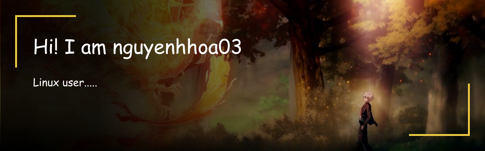

# Nguyễn Hữu Hòa

## Giới thiệu
Xin chào! Mình là **Nguyễn Hữu Hòa**, hiện đang là học sinh có một chút kinh nghiệm về Python và Linux. Mình đang phát triển các app script tự động hóa, mini-app và tiện ích.

---

## Kỹ năng

- **Hệ điều hành & DevOps**  
  - Linux (Fedora, Ubuntu, Debian, Nobara…)    
  - Desktop Environments (GNOME, KDE, Xfce,…)  
  - Shell Scripting (Bash, Zsh), Batch Script  

- **Lập trình**  
  - **Python**: viết tool, tự động hoá, GUI với CustomTkinter  
  - Linux Shell scripting  
  - Batch script (Windows)  

---

## Dự án nổi bật

### [Mini Apps Launcher](https://github.com/nguyenhhoa03/mini-apps) 
> Trình khởi chạy tiện ích
- Giao diện trực quan, dễ tìm kiếm và khởi chạy application.  
- Tự động cập nhật phần mềm từ GitHub.  
- Hỗ trợ filter, search nhanh và khởi chạy script chỉ với một cú click.  

### [Simple Website Templates](https://github.com/nguyenhhoa03/simple-website)
> Các mẫu website mã nguồn mở dành cho mọi người.
- Thuần html/css/js không dùng dependencies, frameworks ngoài.
- Thiết kế đẹp: Hiện đại, [dễ dàng áp dụng chỉnh sửa](https://github.com/nguyenhhoa03/web-editor)
- Mã nguồn mở: Miễn phí, dễ dàng chỉnh sửa tùy ý mãi mãi.

---

## Liên kết

- 🔗 GitHub: [nguyenhhoa03](https://github.com/nguyenhhoa03)
- 📧 Email: nguyenhhoa03@gmail.com

---

## Cách liên hệ  
Mình luôn sẵn sàng trao đổi, hợp tác hoặc hỗ trợ nếu bạn có bất kỳ thắc mắc nào về Python, Linux.  
Hãy tạo issue hoặc gửi email cho mình nhé!

---
